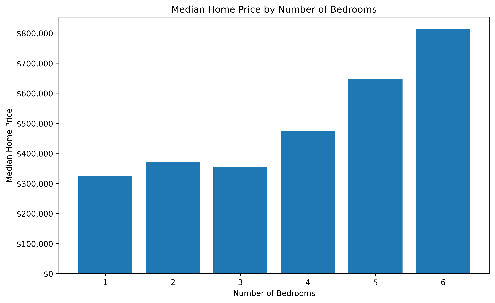
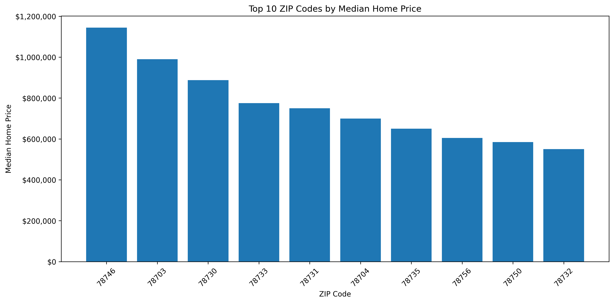
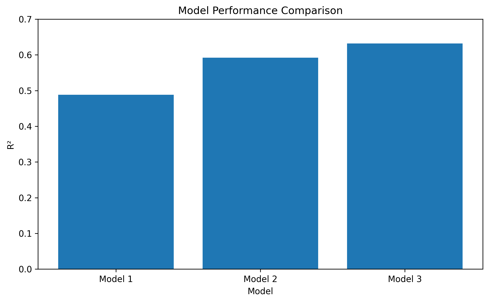
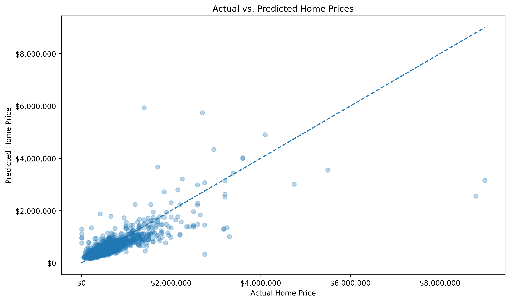
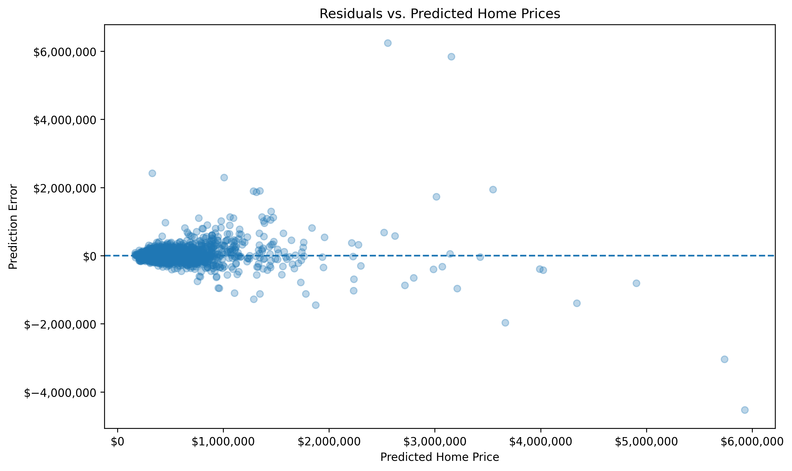

# Austin Housing Price Analysis

## Overview

This project analyzes housing prices in the Austin, Texas area using Python and machine learning. The goal was to identify which housing characteristics and geographic factors are associated with home prices and evaluate how accurately home prices can be predicted.

The project includes data cleaning, exploratory data analysis, statistical analysis, data visualization, feature engineering, and multiple linear regression models.

## Research Questions

- What housing characteristics are most strongly associated with home prices?
- How much do home prices vary across ZIP codes?
- Does adding location improve the ability to predict home prices?
- How well can housing characteristics and location predict home prices?

## Dataset

The dataset contains approximately 15,000 Austin-area property listings and includes information such as:

- Home price
- Living area
- Number of bedrooms
- Number of bathrooms
- Year built
- Garage spaces
- Parking spaces
- ZIP code
- Geographic coordinates
- Property characteristics

After data cleaning, 15,012 properties were used for analysis.

## Tools & Technologies

- Python
- Pandas
- NumPy
- Matplotlib
- Scikit-learn
- Jupyter Notebook

## Data Cleaning

The dataset was inspected for missing values, unusual observations, and extreme values.

The analysis identified:

- 15,171 original property records
- 47 variables
- 2 missing property descriptions
- 47 properties with zero bedrooms
- 125 properties with zero bathrooms
- 14 properties with living areas greater than 10,000 sq. ft.

To reduce the influence of unrealistic or extreme observations, the analysis was restricted to properties with:

- Positive home prices
- Living areas between 500 and 10,000 sq. ft.
- 1–10 bedrooms
- 1–10 bathrooms

This resulted in 15,012 properties for modeling.

## Exploratory Data Analysis

### Home Price vs. Living Area

Living area showed a positive relationship with home price.

The correlation between living area and home price was approximately **0.612**, indicating a moderate positive relationship.


### Home Price by Number of Bedrooms

Median home prices generally increased as the number of bedrooms increased.



### Home Prices by ZIP Code

Home prices varied substantially across Austin ZIP codes.

The highest-median-price ZIP codes included areas with median prices above $1 million, demonstrating the importance of geographic location in the housing market.



## Predictive Modeling

Three linear regression models were developed and evaluated using a 80/20 train-test split.

### Model 1 — Housing Characteristics

Predictors:

- Living area
- Bedrooms
- Bathrooms
- Year built
- Garage spaces
- Parking spaces

**R²: 0.488**

### Model 2 — Characteristics + ZIP Code

ZIP codes were converted into categorical variables using one-hot encoding.

**R²: 0.592**

Adding location increased the model's R² by approximately 10.4 percentage points.

### Model 3 — Log-Transformed Price

The target variable was transformed using the natural logarithm of home price.

**R²: 0.632**

Model 3 also achieved:

- **MAE: $111,841**
- **RMSE: $274,707**



## Model Performance

| Model | R² | MAE | RMSE |
|---|---:|---:|---:|
| Model 1 | 0.488 | $168,732 | $322,948 |
| Model 2 | 0.592 | $137,389 | $288,365 |
| Model 3 | 0.632 | $111,841 | $274,707 |

The results show that adding geographic information and using a log transformation improved predictive performance.

## Actual vs. Predicted Prices

The final model produced a clear positive relationship between actual and predicted home prices. However, prediction errors were larger among some of the most expensive properties.



## Model Diagnostics

Residual analysis showed that most predictions were relatively close to the zero-error line, while expensive properties produced substantially larger errors.

This suggests that the model performs better for typical properties than for luxury homes.



## Key Findings

1. Living area had a moderate positive correlation with home price (r ≈ 0.612).
2. Bathrooms had a stronger simple correlation with price than bedrooms.
3. Home prices varied substantially across Austin ZIP codes.
4. Adding ZIP-code information improved R² from 0.488 to 0.592.
5. Log-transforming home prices increased R² to 0.632.
6. The final model reduced MAE to approximately $111,841.
7. The model had larger prediction errors for some high-priced properties.

## Limitations

This analysis does not capture every factor that influences housing prices. Variables such as neighborhood amenities, school quality, property condition, renovations, lot characteristics, and proximity to major locations could improve the model.

The dataset also contains some unusual observations and extreme home prices, which can make prediction more difficult.

The regression results should therefore be interpreted as associations and predictive relationships rather than evidence of causal effects.

## Future Improvements

Potential improvements include:

- Testing additional machine learning models
- Adding neighborhood and geographic features
- Engineering price-per-square-foot features
- Using cross-validation
- Testing Random Forest and Gradient Boosting models
- Hyperparameter tuning
- Building an interactive housing-price dashboard

## Project Structure

```text
austin-housing-analysis/
│
├── data/
│   └── austinHousingData.csv
│
├── notebooks/
│   └── housing_analysis.ipynb
│
├── visualizations/
│   ├── actual_vs_predicted.png
│   ├── model_comparison.png
│   ├── price_by_bedrooms.png
│   ├── price_by_zipcode.png
│   ├── price_vs_living_area.png
│   └── residuals.png
│
├── README.md
└── requirements.txt